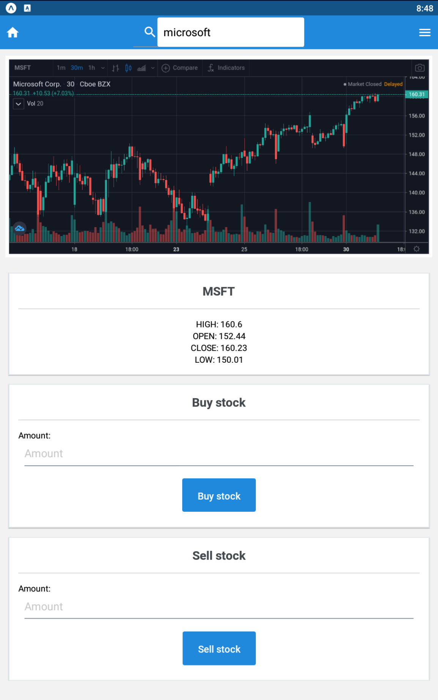

# Mobile Project
1.[About](#1)
2.[Technologies](#2)
3.[Installation](#3)
4.[Running The Application](#4)
5.[Functionalities](#5)
6.[Team](#6)

# 1. About:

 This is a simple mobile application allowing users to buy or sell stocks, and build a portfolio with the current valuation of their stocks. 
 

#### Example of buying/selling stock:
 

# 2. Technologies:
In this project we have used the following Technologies:
1. React Native
2. ASP.net(API) 
3. Sql-Server

### 2.1 Authentication
For Authentication we implemented JWT based authentication in our project. It is a self-managed authentication system.
### 2.2 Stock Data
The project used https://finnhub.io/ API to pull stock data into the project. 
### 2.3 User Data
For persistent data storage, We have Used ASP.net API end points, hosted through Azure which stored the data in Sql Server for user portfolio data. Below is the UML Diagram:

### 2.4 UI
For the UI, React Native has been used. The UI is user-friendly for the end users. 

# 3. Installation
To run the project the following steps are required:
### 3.1 Clone
This repo should be cloned to your local machine using https://github.com/tomkf/mobile_project.git
### 3.2 Installation (Client)
    cd to the root folder of clinet 
    npm install
### 3.3 Installation (Server)
##### Through the Package Manager Console, execute the following commands:
    Drop-Database
    Remove-Migration
    Add-Migration InitialCreate
    Update-Database

# 4. Running the Application
1. After installing the dependencies, from the client folder run the command "npm start" 
2. This will open the Expo client in your browser, from here ensure "Lan" is selected, and copy paste this address to your clipboard.
3. Run an emulator of your choice (we choose to use BlueStacks for development), and copy paste the lan address to it. 

# 5. Functionalities
1.	Register for an account
2.	Login/Logout
3.	Search stocks by symbol or company name
4.	Buy and Sell stocks 
4. User Portfolio
    - Current total portfolio value
    - List of current positions
    - Simple line chart of portfolio 

# 6. Team
1. <a href="https://github.com/dotai2012" target="_blank"> Tai Thien </a>
2. <a href="https://github.com/tomkf" target="_blank"> Thomas </a>
3. <a href="https://github.com/choipeter11" target="_blank"> Peter </a>
4. <a href="https://github.com/Ibrahimshahristani" target="_blank"> Ibrahim </a> 
